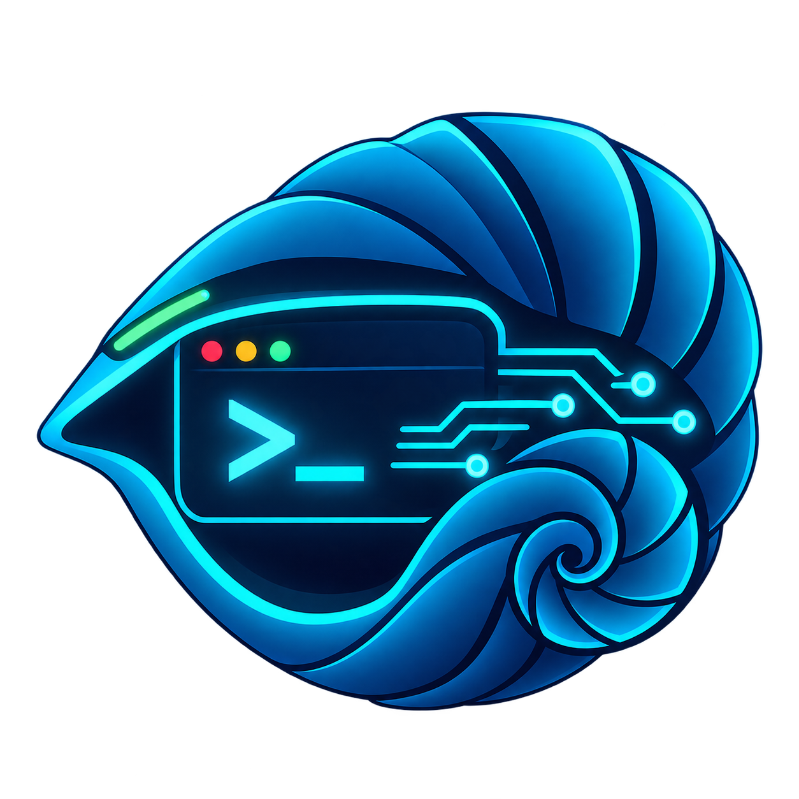

<div align="center">
  
</div>

<div align="center">

# 🐚 CyanShell

### Cross-Platform PHP Web Shell

[](LICENCE)
[](https://www.php.net/)
[](https://github.com/)
[](https://github.com/)

</div>

---

## 📖 Table of Contents

- [What It Does](#what-it-does)
- [Feature Breakdown](#feature-breakdown)
- [Command Palette](#command-palette)
- [Usage](#usage)
- [Design System](#design-system)
- [Project Structure](#project-structure)
- [License](#license)
- [References](#references)

---

<a id="what-it-does"></a>

## ⚙️ What It Does

CyanShell is a **single-file PHP web shell** that executes OS commands on the host through a modern terminal UI. One HTTP POST request is all it takes to run anything the web server user can run.

- **No authentication.** Access to the URL equals access to the shell.
- **No dependencies.** Pure PHP + vanilla CSS. Drop the file, open it, use it.
- **Cross-platform.** Auto-detects Linux vs Windows and adapts the execution path.
- **Session-aware.** Working directory and command history persist between requests.

Two variants ship in this repo:

| File | Target | Shell |
|---|---|---|
| `cyanshell-linux.php` | Linux / Unix | `/bin/sh -c <cmd>` |
| `cyanshell-windows.php` | Windows | `cmd.exe /c <cmd>` |

---

<a id="feature-breakdown"></a>

## 🔍 Feature Breakdown

| Feature | Description |
|---|---|
| **Command Execution** | Runs OS commands via `proc_open()`. Uses `cmd.exe /c` on Windows, `/bin/sh -c` on Linux. |
| **Persistent CWD** | `cd` is handled natively and stored in `$_SESSION['cwd']`. Every later command runs in that directory. |
| **Command History** | Last 100 commands kept in session. Navigate with ↑ / ↓ arrow keys like a real shell. |
| **Command Palette** | Curated dropdown of pre-built commands grouped by category — recon, privesc, creds, persistence, etc. |
| **Cross-Platform** | Detects `PHP_OS` on load and picks the right execution path automatically. |
| **Streamed Output** | Captures both `stdout` and `stderr`, merges them, and HTML-escapes the result before rendering. |
| **Zero Install** | No composer, no build step, no config. A single `.php` file is the entire application. |

---

<a id="command-palette"></a>

## 🧭 Command Palette

The dropdown ships with ready-to-run commands, organized into groups:

| Group | Focus |
|---|---|
| **1. System Recon** | OS, users, network, processes, services, cron |
| **2. SUID / SGID / Capabilities** | Linux privilege vectors |
| **3. Privilege Escalation** | Sudo, kernel, CVE checks, crontab |
| **4. Credential Harvesting** | `.env`, `wp-config.php`, history files, SSH keys, config files |
| **5. Persistence** | Cron backdoor, `authorized_keys`, `.bashrc`, Run keys, schtasks |
| **6. File Transfer** | `wget`, `curl`, `certutil`, PowerShell `IWR`, netcat |
| **7. Internal Pivoting** | Ping sweep, `/dev/tcp` port scan |
| **8. Log Tampering** | Clear `auth.log`, `syslog`, history |

Each entry is just a string in the `$command_groups` array — easy to edit, add, or remove.

---

<a id="usage"></a>

## 🖥️ Usage

1. Host `cyanshell-linux.php` or `cyanshell-windows.php` on a PHP-enabled web server.
2. Open the file in a browser.
3. Type a command → press **Enter**.
4. Use the **dropdown** to load a pre-built command.
5. `cd <path>` changes the session working directory.

The prompt always shows `user@host:/current/path$`.

---

<a id="design-system"></a>

## 🎨 Design System

The entire UI is built with vanilla CSS — no framework, no build step. Design tokens live in `:root`:

```css
:root {
    --bg:  #0f172a;   /* base background        */
    --bg2: #1e293b;   /* elevated surfaces      */
    --cy:  #22d3ee;   /* primary accent (cyan)  */
    --gr:  #10b981;   /* prompt / success       */
    --rd:  #ef4444;   /* danger                 */
    --am:  #f59e0b;   /* warning / dropdown     */
    --tx:  #f1f5f9;   /* primary text           */
    --mu:  #64748b;   /* muted text             */
    --bd:  #475569;   /* borders                */
}
```

Notable patterns used:

| Pattern | Technique |
|---|---|
| Neon glow | `box-shadow: 0 0 16px rgba(34,211,238,.25)` |
| Ambient light | `radial-gradient` overlay on `body` |
| Scanline header | `::before` pseudo-element with linear gradient |
| Themed scrollbar | `::-webkit-scrollbar-thumb` + `:hover` |
| Custom select arrow | Inline SVG data-URI as `background-image` |
| Micro-interaction | `transform: translateY(-1px)` on button hover |

---

<a id="project-structure"></a>

## 📁 Project Structure

```
cyanshell/
├── README.md
├── LICENCE
├── logo.png
└── src/
    ├── cyanshell-linux.php      # Linux variant
    └── cyanshell-windows.php    # Windows variant
```

---

<a id="license"></a>

## 📜 License

Released under the [MIT License](LICENCE).

```
MIT License

Copyright (c) 2026 CyanShell Project

Permission is hereby granted, free of charge, to any person obtaining a copy
of this software and associated documentation files (the "Software"), to deal
in the Software without restriction, including without limitation the rights
to use, copy, modify, merge, publish, distribute, sublicense, and/or sell
copies of the Software, and to permit persons to whom the Software is
furnished to do so, subject to the following conditions:

The above copyright notice and this permission notice shall be included in all
copies or substantial portions of the Software.

THE SOFTWARE IS PROVIDED "AS IS", WITHOUT WARRANTY OF ANY KIND, EXPRESS OR
IMPLIED, INCLUDING BUT NOT LIMITED TO THE WARRANTIES OF MERCHANTABILITY,
FITNESS FOR A PARTICULAR PURPOSE AND NONINFRINGEMENT. IN NO EVENT SHALL THE
AUTHORS OR COPYRIGHT HOLDERS BE LIABLE FOR ANY CLAIM, DAMAGES OR OTHER
LIABILITY, WHETHER IN AN ACTION OF CONTRACT, TORT OR OTHERWISE, ARISING FROM,
OUT OF OR IN CONNECTION WITH THE SOFTWARE OR THE USE OR OTHER DEALINGS IN THE
SOFTWARE.
```

---

<a id="references"></a>

## 📚 References

**Technique & Background**
- [MITRE ATT&CK — T1505.003: Web Shell](https://attack.mitre.org/techniques/T1505/003/)
- [MITRE ATT&CK — T1059.004: Unix Shell](https://attack.mitre.org/techniques/T1059/004/)
- [MITRE ATT&CK — T1059.003: Windows Command Shell](https://attack.mitre.org/techniques/T1059/003/)
- [OWASP — Web Shell](https://owasp.org/www-community/vulnerabilities/Web_Shell)

**PHP Manual**
- [`proc_open()`](https://www.php.net/manual/en/function.proc-open.php)
- [`session_start()`](https://www.php.net/manual/en/function.session-start.php)
- [`htmlspecialchars()`](https://www.php.net/manual/en/function.htmlspecialchars.php)

**Design**
- [Tailwind Slate Palette](https://tailwindcss.com/docs/customizing-colors)
- [MDN — CSS Custom Properties](https://developer.mozilla.org/en-US/docs/Web/CSS/Using_CSS_custom_properties)

**Related Tools**
- [p0wny-shell](https://github.com/flozz/p0wny-shell) — single-file PHP shell
- [b374k](https://github.com/b374k/b374k) — feature-rich PHP shell
- [AntSword](https://github.com/AntSwordProject/antSword) — cross-platform webshell manager

---

<div align="center">

**Legal Notice** — Provided for authorized security testing and research only.
Users are responsible for complying with all applicable laws.

</div>
